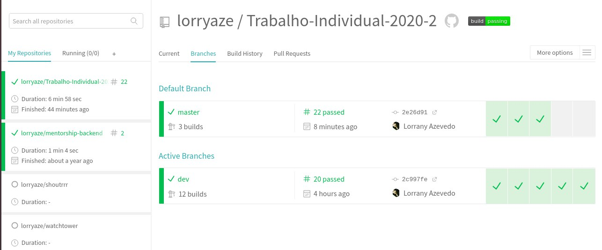
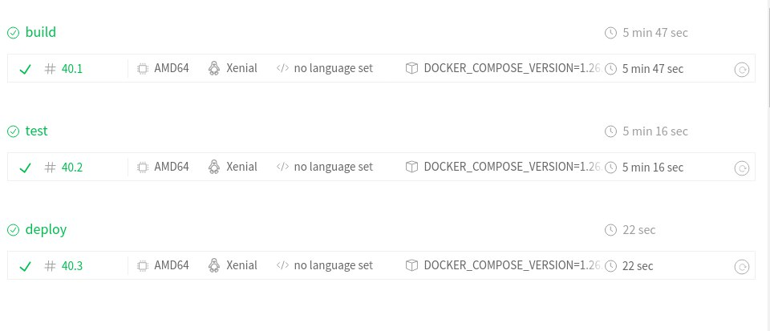
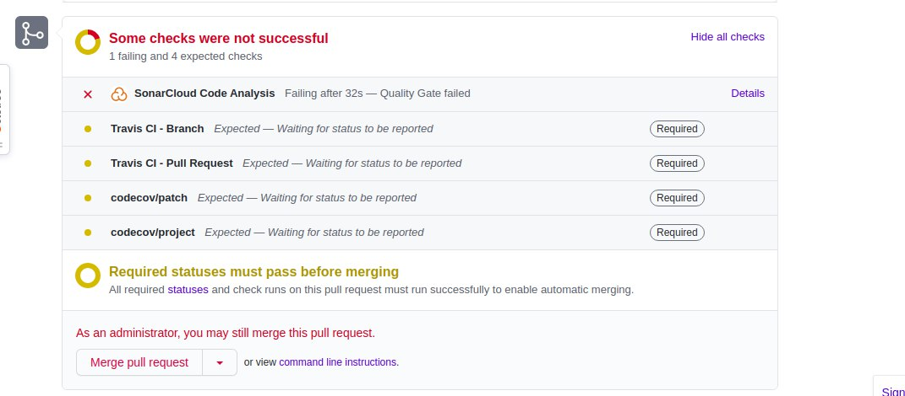
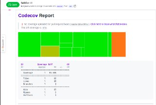

# Solução do Trabalho Individual

[](https://codecov.io/gh/lorryaze/Trabalho-Individual-2020-2)
[](https://sonarcloud.io/dashboard?id=lorryaze_Trabalho-Individual-2020-2)
[](https://travis-ci.com/lorryaze/Trabalho-Individual-2020-2)

**Aluna**: Lorrany dos Santos Azevedo

**Matricula**: 16/0132550

## Containerização

Cada aplicação do projeto roda em um container diferente, logo temos um container pro backend, pro frontend e um para o banco de dados. Para facilitar a execução do projeto utilizamos o Docker-Compose para que os 3 containers fossem buildados e rodados de uma só vez. Para rodar o projeto basta rodar o seguinte comando na pasta root.

```console
docker-compose up
```

### Testes

Para executar os testes no ambiente dos containers basta executar os seguintes comandos:

Para os testes do client (frontend):

```console
docker-compose run client yarn quasar test --unit jest
```
Para os testes da api (backend):

```console
docker-compose run api ./test_api.sh
```

## Integração Continua

A integração contínua foi feita com o TravisCI e tem estágios de build, teste e deploy. Todas as configurações são feitas no arquivo .travis.yml no root do projeto, e ambos os estágios são rodados sempre que um novo commit é feito. 





A branch master do repositório está protegida e os prs vão ser aceitos apenas se todos os requisitos forem cumpridos.



## Coverage e Coleta de métricas

A cobertura de código foi feita utilizando o codecov que mostra a porcentagem de cobertura de código do projeto nos prs.



Já a coleta de métricas pra qualidade de código foram feitas usando o sonarcloud.

## Deploy

O deploy da aplicação foi feito através do Heroku, como o repositório tem duas aplicações diferentes setamos um Procfile para cada aplicação e fizemos o deploy de cada um de maneira indpendente.

A aplicação do cliente (frontend) se encontra no seguinte endereço:

[Fronted- Client Aplication](https://client-dasdasd.herokuapp.com/#/)

Já a api se encontra no seguinte endereço:

[Backend- Api aplication](https://api-trabalho-indivudual.herokuapp.com/task/)

## Referências

[How to deploy a monorepo to multiple heroku apps using github actions](https://medium.com/softup-technologies/how-to-deploy-a-monorepo-to-multiple-heroku-apps-using-github-actions-65e87dc27878)

[Deploying a Quasar app with heroku](https://quasar.dev/quasar-cli/developing-spa/deploying#deploying-with-heroku)

[Travis Documentation](https://docs.travis-ci.com/)
